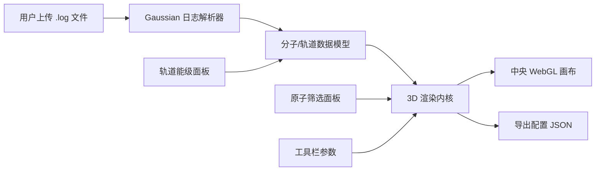

## 1. 产品概述

分子轨道可视化分析平台，面向计算化学研究人员，解析 Gaussian 量子化学输出文件，以交互式 WebGL 3D 方式渲染分子轨道等值面、原子结构与化学键，支持轨道切换、原子筛选与参数导出。

- 核心目标：提供高效、流畅的大分子轨道可视化工具，替代传统桌面化学软件的部分功能
- 目标用户：计算化学研究员、理论化学学生、分子模拟工程师

## 2. 核心功能

### 2.1 用户角色
无角色区分，所有用户享有完整功能权限。

### 2.2 功能模块
1. **Gaussian 日志解析器**：解析 .log/.out 文件，提取分子坐标、基组信息、分子轨道系数与能级
2. **3D 渲染内核**：基于 WebGL/Three.js 的分子轨道等值面实时渲染，支持 Marching Cubes 算法
3. **轨道能级控制**：能级列表展示、HOMO/LUMO 快速定位、正负相位配色切换
4. **原子筛选与高亮**：按元素、残基、索引筛选原子，支持选中高亮与隐藏
5. **参数导出模块**：将当前视角、轨道选择、等值面阈值等配置保存为 JSON 文件
6. **事件总线**：模块间松耦合通信，支持轨道切换、原子选择、视角变化等事件广播

### 2.3 页面详情
| 页面名称 | 模块名称 | 功能描述 |
|----------|----------|----------|
| 主工作区 | 文件上传栏 | 拖拽或点击上传 Gaussian 输出文件，解析进度展示 |
| 主工作区 | 轨道能级面板 | 能级柱状图/列表，点击切换轨道，显示占据态/空态 |
| 主工作区 | 3D 分子画布 | 中央渲染区域，拖拽旋转、滚轮缩放、右键平移 |
| 主工作区 | 原子筛选面板 | 元素列表勾选、原子分组显示、显隐控制 |
| 主工作区 | 工具栏 | 等值面阈值调节、相位配色切换、导出配置按钮 |

## 3. 核心流程

用户上传 Gaussian .log 文件 → 解析器提取分子结构与轨道数据 → 渲染内核构建 3D 场景 → 用户通过能级面板切换轨道 → 实时重新计算等值面并渲染 → 用户筛选原子、调节视角 → 导出配置 JSON。

## 4. 用户界面设计

### 4.1 设计风格
- **主色**：深空蓝 `#0f172a`（s late-900）作为背景，体现科研严谨感
- **强调色**：正相位青蓝 `#38bdf8`，负相位橙红 `#f97316`，HOMO/LUMO 高亮金 `#facc15`
- **中性色**：slate 灰阶系列，文字用 slate-100/300/400
- **按钮风格**：方角微圆角（rounded-md），扁平设计，悬停时边框高亮
- **字体**：等宽字体 JetBrains Mono 用于数据展示（能级、坐标），Inter 用于界面文本
- **布局风格**：三栏式固定布局，左右面板可折叠，中央画布自适应
- **图标风格**：lucide-react 线性图标，stroke 1.5px

### 4.2 页面设计概览
| 页面名称 | 模块名称 | UI 元素 |
|----------|----------|----------|
| 主工作区 | 文件上传栏 | 拖拽区虚线边框、文件图标、解析进度条、文件名标签 |
| 主工作区 | 轨道能级面板 | 能级垂直排列、占据态/空态分色、HOMO/LUMO 星标、选中态发光边框 |
| 主工作区 | 3D 分子画布 | 深色背景渐变、轨道半透明等值面、原子球体（CPK 配色）、化学键圆柱体 |
| 主工作区 | 原子筛选面板 | 元素符号色块（CPK）、复选框、原子计数、分组折叠 |
| 主工作区 | 工具栏 | 滑杆（阈值）、双色切换按钮、导出/重置图标按钮 |

### 4.3 响应式
桌面端优先（≥ 1280px），最小支持 1024px 宽度；左右面板在窄屏下可折叠为图标栏。

### 4.4 3D 场景指导
- **环境**：纯深色径向渐变背景，无 HDRI，聚焦分子本身
- **光照**：两盏方向光（主光 + 补光）+ 环境光，避免强阴影
- **相机**：PerspectiveCamera，fov 45，初始距离自动适配分子大小
- **交互**：OrbitControls 拖拽旋转、滚轮缩放、右键平移，阻尼开启
- **后处理**：轻微 Bloom 效果增强轨道等值面发光感，FXAA 抗锯齿
- **性能预算**：80 原子分子切换轨道 ≤ 300ms，FPS ≥ 30
