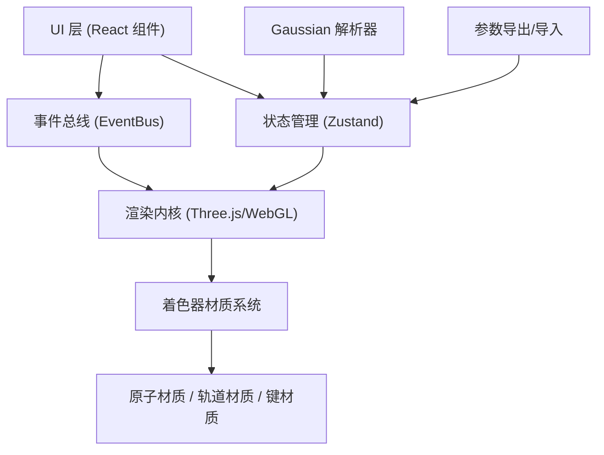
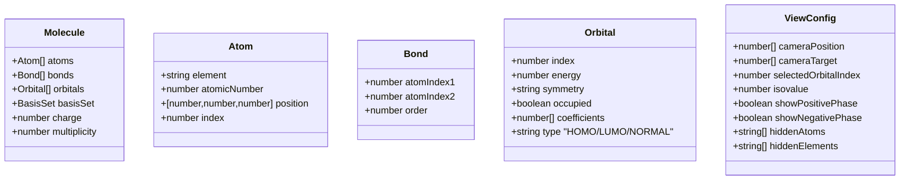

## 1. 架构设计



## 2. 技术栈说明

- **前端框架**：React 18 + TypeScript 5 + Vite 5
- **状态管理**：Zustand（轻量、原子化状态）
- **3D 渲染**：Three.js 0.160 + @react-three/fiber + @react-three/drei + @react-three/postprocessing
- **样式方案**：TailwindCSS 3
- **图标库**：lucide-react
- **数学计算**：自定义 Marching Cubes 实现 + Web Worker 并行计算
- **性能优化**：InstancedMesh（原子/键）、BufferGeometry 复用、Web Worker 计算等值面

## 3. 路由定义
| 路由 | 用途 |
|------|------|
| / | 主工作区（唯一页面） |

## 4. 核心模块文件结构

```
src/
├── types/              # 全局类型定义
│   └── index.ts        # Molecule, Orbital, Atom, CameraState 等
├── config/             # 着色材质与配色配置
│   └── materials.ts    # CPK 元素色、轨道相位色、材质参数
├── parser/             # Gaussian 日志解析器
│   └── GaussianParser.ts
├── core/               # 3D 渲染内核
│   ├── OrbitalRenderer.ts    # 轨道等值面计算与渲染
│   ├── MoleculeRenderer.ts   # 原子/化学键渲染
│   └── MarchingCubes.ts      # 等值面生成算法
├── bus/                # 组件事件总线
│   └── EventBus.ts
├── stores/             # Zustand 状态
│   └── useMoleculeStore.ts
├── hooks/              # 自定义 React Hooks
│   ├── useOrbitalControl.ts
│   └── useAtomSelection.ts
├── components/         # UI 组件
│   ├── FileUploadPanel.tsx
│   ├── OrbitalLevelPanel.tsx
│   ├── MoleculeCanvas.tsx
│   ├── AtomFilterPanel.tsx
│   └── Toolbar.tsx
├── utils/              # 工具函数
│   └── exportConfig.ts
└── App.tsx
```

## 5. 数据模型

### 5.1 核心数据类型



## 6. 性能优化策略

1. **Web Worker 计算**：Marching Cubes 等值面生成在 Worker 线程执行，不阻塞 UI
2. **InstancedMesh**：相同元素的原子使用实例化网格渲染，减少 draw call
3. **Geometry 缓存**：已计算的轨道等值面缓存于 LRU Map，切换时优先命中
4. **渐进式渲染**：大分子先渲染低精度等值面，后台计算高精度后替换
5. **事件节流**：滚轮缩放/轨道切换事件 16ms 节流
